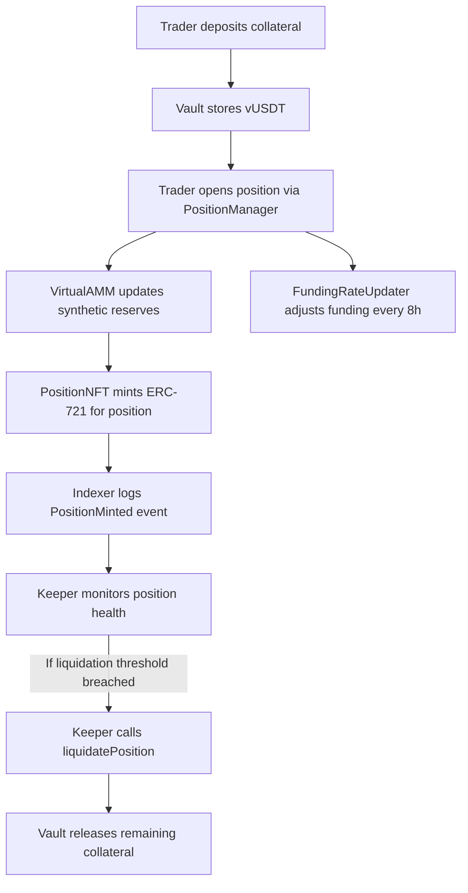

# Perp-EX — Advanced Decentralized Perpetual Futures Protocol

## 1️⃣ Overview

**Perp-EX** is an advanced **vAMM-based decentralized perpetual futures protocol** where each position is represented as a **non-transferable NFT**. The system includes three powerful off-chain modules — a **Liquidation Keeper**, **Custom Blockchain Indexer**, and **Funding Rate Updater** — that together ensure smooth, automated, and verifiable perpetual trading operations.

Perp‑EX merges on-chain execution with off-chain intelligence to maintain market integrity and real-time system resilience.

---

## 2️⃣ Architecture

### 🧱 On-Chain Stack

| Component           | Description                                                                                  |
| ------------------- | -------------------------------------------------------------------------------------------- |
| **VirtualAMM**      | Core AMM engine simulating synthetic price discovery for leveraged perpetuals.               |
| **Vault**           | Collateral management system ensuring capital efficiency and maintaining utilization limits. |
| **PositionManager** | Handles trade lifecycle: opening, closing, liquidations, and funding updates.                |
| **PositionNFT**     | ERC-721 token encapsulating all position metadata and ownership rights.                      |
| **PriceOracle**     | Integrates Chainlink and on-chain feeds to derive fair funding rates.                        |

### ⚙️ Off-Chain Modules

| Module                   | Function                                                                                  |
| ------------------------ | ----------------------------------------------------------------------------------------- |
| **Liquidation Keeper**   | Monitors positions and triggers liquidations automatically when margin requirements fail. |
| **Blockchain Indexer**   | Extracts and stores on-chain events in a database for analytics and dashboards.           |
| **Funding Rate Updater** | Regularly recalculates and submits new funding rates (every 8 hours).                     |

---

## 3️⃣ How It Works — Interactive Flow



This flow ensures autonomous position management with on-chain transparency and off-chain automation.

---

## 4️⃣ Keeper: Automated Liquidation System

### Core Logic

* Scans blockchain for **PositionMinted** events.
* Monitors each position’s health using `isPositionLiquidatable()`.
* Simulates liquidation transactions before execution.
* Retries failed calls with exponential backoff.

### Technical Highlights

* Uses **Viem** clients for public/wallet RPC access.
* Performs **gas estimation** and applies a safety multiplier.
* Supports **configurable retries**, **graceful shutdown**, and **low-balance warnings**.

```bash
# Start keeper
pnpm start:keeper
```

---

## 5️⃣ Indexer: Real-Time Data Synchronizer

### Responsibilities

* Subscribes to events: `PositionMinted`, `PositionOpened`, `PositionClosed`, `PositionLiquidated`.
* Writes normalized position data into a database (Mongo/Postgres supported).
* Uses **block chunking (9 blocks)** per fetch to bypass RPC rate limits.
* Continuously syncs forward using `setInterval()`.

### Database Schema

| Collection       | Fields                                                               |
| ---------------- | -------------------------------------------------------------------- |
| **positions**    | tokenId, owner, collateral, leverage, entryPrice, isLong, timestamps |
| **liquidations** | tokenId, owner, liquidator, txHash, blockNumber, timestamp           |
| **syncStatus**   | contractAddress, lastSyncedBlock                                     |

```bash
# Start indexer
pnpm start:indexer
```

---

## 6️⃣ Funding Rate Updater

### Logic

* Reads last funding timestamp via `lastFundingTime()`.
* If >8 hours elapsed, triggers `updateFundingRate()`.
* Simulates transaction for safety before broadcast.

### Features

* Custom **gas multiplier** and **safe retry**.
* Reports time remaining for next funding window.

```bash
# Run updater
pnpm start:updater
```

---

## 7️⃣ Configuration

Example `.env`:

```env
RPC_URL=https://rpc.ankr.com/eth_sepolia/<key>
PRIVATE_KEY=0xYOURPRIVATEKEY
CHAIN_ID=11155111
POSITION_MANAGER_ADDRESS=0x...
POSITION_NFT_ADDRESS=0x...
POLL_INTERVAL_MS=15000
MAX_RETRIES=3
GAS_MULTIPLIER=1.2
DB_URI=mongodb://localhost:27017/perpex
```

---

## 8️⃣ Deployment

```bash
# Deploy contracts
forge script scripts/deploy/Deploy.s.sol --rpc-url <RPC> --broadcast

# Update off-chain config with deployed addresses
```

For persistent services, use **PM2** or **Docker Compose**.

---

## 9️⃣ Interactive Monitoring

* Add a dashboard that queries indexer DB and visualizes open/closed/liquidated positions.
* Integrate with Grafana or a Next.js admin panel using WebSocket updates.
* Display funding updates and liquidation triggers in real time.

---

## 🔒 Security Practices

* Use separate wallets for Keeper and Updater.
* Secure private keys in encrypted secrets managers.
* Implement gas bump strategies and transaction replacement for reliability.

---

## 🌍 Roadmap

* Multi‑pair vAMM pools (ETH/USDT, BTC/USDT)
* Permissionless keeper network
* Cross‑chain deployment via LayerZero
* Governance‑based funding adjustment

---

## 🧠 Summary

Perp‑EX brings together:

* **On‑chain transparency** (vAMM + NFTs)
* **Off‑chain automation** (keeper, indexer, updater)
* **Scalable, modular architecture** ready for production or research use.

The system is designed for **autonomous perpetual markets** with minimal trust, complete traceability, and powerful analytics potential.

---

Need a **Docker Compose** setup or a **PM2 ecosystem config** next?
